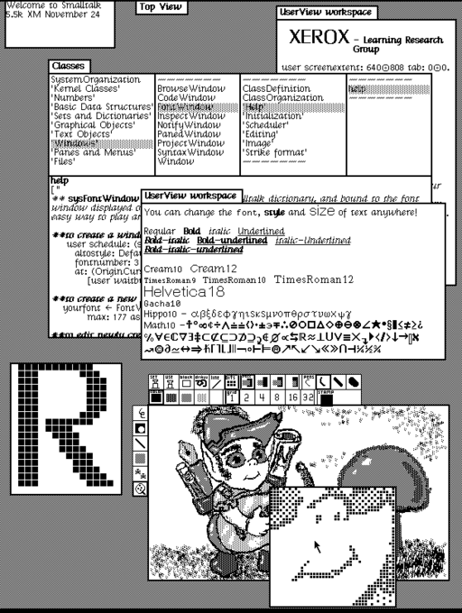

+++
title = "Goodbye, bit rot"
date = 2021-02-01T00:00:00.000Z
summary = """
Multi Stage builds are great for minimizing the size of your container. The
general idea is you have..."""

[taxonomies]
tags = ["Nix", "foundations", "cryptic"]

[extra]
author = "Marco"
+++

Take a look at this picture:



That's a photo of Smalltalk 76 running the prototypical desktop UI. It's
taken for granted that this photo will be viewable for the indefinite future
(or as long as we keep a PNG viewer around). But when we think about code,
maybe the very same Smalltalk code we took this photo of, it's assumed that
eventually that code will stop running. It'll stop working because of a
mysterious force known as [bit
rot](https://en.wikipedia.org/wiki/Software_rot). Why? It's this truly
inevitable? Or can we do better?

## We can do better

Bit rot often manifests in the case where some software _A_ relies on a certain
configured environment. Imagine _A_ relies on a shared library _B_. As time
progresses, the shared library _B_ can (and probably will) be updated
independently of _A_. Thus breaking _A_. But what if _A_ could say it
explicitly depends on version _X.Y.Z_ of _B_, or even better yet, the version
of the library that hashes to the value `0xBADCOFFEE`. Then you break the
implicit dependency of a correctly configured environment. _A_ stops
depending on the world being in a certain state. Instead, _A_
*explicitly defines* what the world it needs should look like.

## Enter Nix

This is what [Nix](https://nixos.org/) gives you. A way to explicitly define
what a piece of software needs to build and run. Here's an example of the
definition on how to build the [GNU
Hello](https://www.gnu.org/software/hello/) program:

```nix
with (import <nixpkgs> {});
derivation {
  name = "hello";
  builder = "${bash}/bin/bash";
  args = [ ./builder.sh ];
  buildInputs = [ gnutar gzip gnumake gcc binutils-unwrapped coreutils gawk gnused gnugrep ];
  src = ./hello-2.10.tar.gz;
  system = builtins.currentSystem;
}
```

It's not necessary to explain this [code in
detail](https://nixos.org/guides/nix-pills/generic-builders.html#idm140737320275008).
It's enough to point out that `buildInputs` defines what the environment should
contain (i.e. it should contain `gnutar`, `gzip`, `gnumake`, etc.). And the
versions of these dependencies are defined by the current version of
`<nixpkgs>`. These dependencies can be further pinned (or _locked_ in the
terminology of some languages like Javascript and Rust) to ensure that this
program will always be built with the same exact versions of its dependencies.
This extends to the runtime as well. This means you can run two different
programs that each rely on a different `glibc`. Or to bring it back to our
initial example, software _A_ will always run because it will always use the
same exact shared library _B_.

## A concrete example. This will never bit rot.

To continue our Smalltalk theme, here's a "Hello World" program that, barring a
fundamental change in how Nix Flakes works, will work forever on an x86_64
linux machine.


The definition of our program, `flake.nix`
```nix
{
  inputs.nixpkgs.url = "github:NixOS/nixpkgs/nixos-20.09";
  outputs =
    { self, nixpkgs }:
    let
      pkgs = nixpkgs.legacyPackages.x86_64-linux;
    in
    {
      defaultPackage.x86_64-linux = pkgs.writeScriptBin "hello-smalltalk" ''
        ${pkgs.gnu-smalltalk}/bin/gst <<< "Transcript show: 'Hello World!'."
      '';
    };
}
```

The pinned version of all our dependencies, `flake.lock`
```jso{
  "nodes": {
    "nixpkgs": {
      "locked": {
        "lastModified": 1606669556,
        "narHash": "sha256-9rlqZ5JwnA6nK04vKhV0s5ndepnWL5hpkaTV1b4ASvk=",
        "owner": "NixOS",
        "repo": "nixpkgs",
        "rev": "ae47c79479a086e96e2977c61e538881913c0c08",
        "type": "github"
      },
      "original": {
        "owner": "NixOS",
        "ref": "nixos-20.09",
        "repo": "nixpkgs",
        "type": "github"
      }
    },
    "root": {
      "inputs": {
        "nixpkgs": "nixpkgs"
      }
    }
  },
  "root": "root",
  "version": 7
}
```

copy those files into a directory and run it:
```bash
❯ nix run
Hello World!
```

## Solid Foundations

With Nix, we can make steady forward progress. Without fear that our foundations
will collapse under us like sand castles. Once we've built something in Nix we
can be pretty sure it will work for our colleague or ourselves in 10 years. Nix
is building a solid foundation that I can no longer live without.

If you haven't used Nix before, here's your call to action:
* Nix's homepage: https://nixos.org/
* Nix's Learning page: https://nixos.org/learn
* Learn Nix in little bite-sized pills: https://nixos.org/guides/nix-pills/

---

## Disclaimer

There are various factors that lead to bit rot. Some are easier to solve than
others. For the purpose of this post I'm only considering programs that are
roughly self contained. For example, if a program relies on hitting a specific
Google endpoint, the only way to use this program would be to emulate the whole
Google stack or rely on that [endpoint existing](https://gcemetery.co/).
Sometimes it's doable to emulate the external API, and sometimes it isn't. This
post is specifically about cases where it is feasible to emulate the external API.
